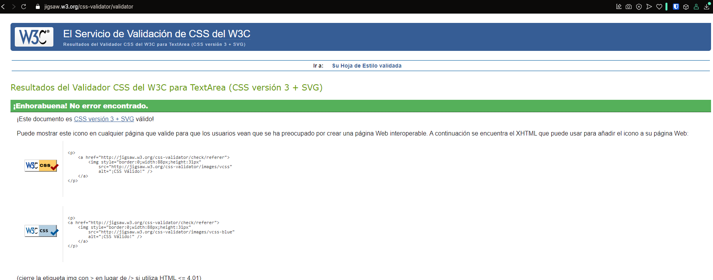
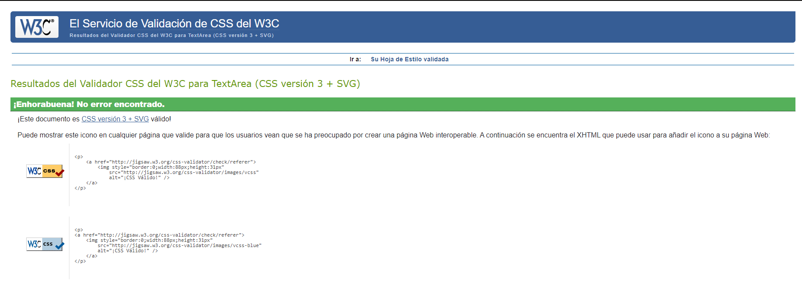

# UT4- Proyecto 3: Maquetando y desarrollando nuestra aplicación web (API). Recuperación 1ª Evaluación

## Sara Sánchez Camilleri, 2DAW B

<br>
<br>
<br>
<br>
<br>

# Incluyendo estilo css de forma directa

Código sacado de la página de error 404 de la versión oscura.

```html
<!-- 
                Hemos probado en ésta página colocar el estilo del texto h1 en la propia etiqueta, aunque para pequeños
                arreglos, en un código pequeño, puede ser fácil, pero teniendo en cuenta que los elementos que se repiten y 
                deben mantener el mismo diseño, es más cómodo, útil y fácil si lo agrupamos archivo concreto que maneje el
                diseño de todos los elementos del mismo tipo de la página. Incluso del resto del proyecto. Por ejemplo, en 
                nuestro proyecto mantenermos una página de estilos globales, que se repetirán a lo largo de distintas páginas,
                y una página de estilos para cada página que lo necesite, para los elementos concretos de esas páginas.
                -->
                    <h1 style="color: greenyellow; font-family: 'Quicksand_Light, Arial';">ERROR 404</h1>
                </div>
```


# Validación de estilos 

  * Validación del .css de estilos globales


  * Validación del .css de estilos de la página principal.



# Videotutorial

[Aquí tienes un enlace al video en Google Drive](https://drive.google.com/file/d/1Lme62q6bJMxNLcUa-ZpUbS3z56tOkT7r/view?usp=drive_link)


# Repositorio en GitHub 

[Enalce al repositorio](https://github.com/SSanCam/recuperacion_interfaces.git)

# Futuras implementaciones

  1. **Multilingüismo**: Implementar un segundo idioma (inglés) en la totalidad de la página, con la posibilidad de agregar más idiomas en el futuro. Para simplificar este proceso, se podrían utilizar plugins o herramientas de traducción automática que reduzcan la necesidad de código o archivos adicionales.

  2. **Mejora de la estructura con React**: Migrar la creación de la página a React para facilitar la reutilización de componentes (como el header, botones, etc.) y mejorar la mantenibilidad del código.

  3. **Optimización de SEO y accesibilidad**: Mejorar el posicionamiento en buscadores (SEO) y garantizar que la página sea accesible para todos los usuarios, siguiendo las mejores prácticas y estándares web.


* ## **Conclusiones finales**
  
Al realizar éste proyecto después de seguir estudiando en paralelo otras opciones de creaciones de APIs, al realizar pruebas y análisis, he identificado áreas de mejora tanto en el rendimiento como en el diseño y la funcionalidad. 

Además, he podido apreciar las ventajas que ofrecen otras herramientas modernas para el desarrollo de APIs y la creación de aplicaciones web, lo que ha abierto puertas a futuras mejoras y la integración de tecnologías más avanzadas, como el uso de React.