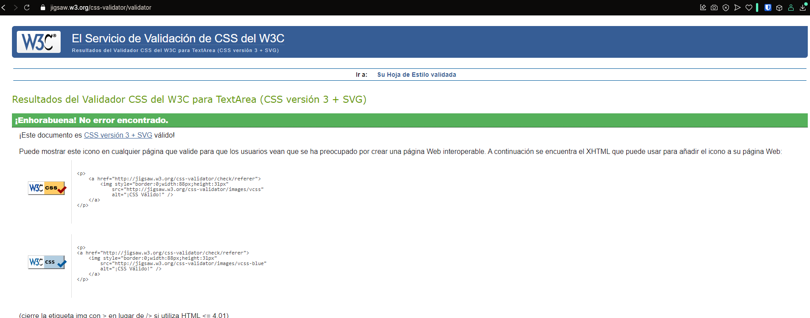
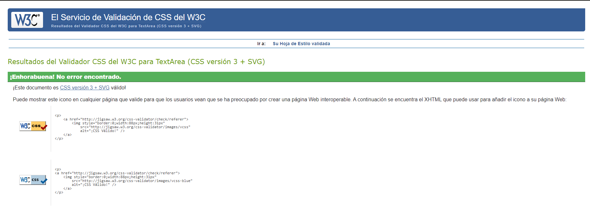

# 1. Descripción del proyecto

En este proyecto desarrollarás una aplicación web de una sola página (SPA) que consuma una API REST pública y muestre sus datos de forma dinámica. La navegación entre las distintas secciones de la aplicación se gestionará mediante React Router, permitiendo una experiencia fluida sin recargas de página. En nuestro módulo se trabajará la maquetación completa de la aplicación web prototipada y testeada en los proyectos anteriores. Este proyecto forma parte de una actividad conjunta con el módulo de Desarrollo Web en Entorno Cliente (DWEC), justamente en el proyecto 4.

# 2. Objetivos del proyecto
Conocer y crear documentos HTML5 aplicando las buenas prácticas.

Conocer y Crear estilos CSS.

Aplicar las buenas prácticas en el diseño de una aplicación web mediante estilos.

Crear interfaces adaptadas a multidispositivos.

Crear animaciones en las interfaces web.

Verificar la adecuación del código a los estándares de calidad.

Utilizar un workflow de desarrollo frontend moderno, que diferencie entornos de 
desarrollo y producción, con las diferencias que correspondan a cada uno.

Utilizar el lenguaje de preprocesado de estilos Sass o PostCSS.

# 3. Resultados de aprendizaje y Criterios de evaluación

## RA2 Crea interfaces Web homogéneos definiendo y aplicando estilos.

CE 2a) Se han reconocido las posibilidades de modificar las etiquetas HTML.

CE 2b) Se han definido estilos de forma directa.

CE 2c) Se han definido y asociado estilos globales en hojas externas.

CE 2d) Se han definido hojas de estilos alternativas.

CE 2e) Se han redefinido estilos.

CE 2f) Se han identificado las distintas propiedades de cada elemento.

CE 2g) Se han creado clases de estilos.

CE 2h) Se han utilizado herramientas de validación de hojas de estilos.

CE 2j) Se han analizado y utilizado preprocesadores de estilos para traducir 
estilos comunes a un código estándar y reconocible por los navegadores.


## RA3 Prepara archivos multimedia para la Web, analizando sus características y manejando herramientas específicas.

CE 3f) Se han realizado animaciones a partir de imágenes fijas.
CE 3h) Se ha aplicado la guía de estilo.

# 4. Prueba
La parte de desarrollo se debe entregar en una carpeta y repositorio de GitHub que contenga exactamente los ficheros y carpetas que se indican a continuación:

dist/ -> compilado para producción con npm run build (si usas otro empaquetador la que por defecto salga)
src/ -> la carpeta de desarrollo (si usas otro empaquetador la que por defecto salga)
package.json -> para ver las dependencias instaladas
Cualquier entrega que contenga la carpeta node_modules, será rechazada.

Las herramientas que utilizaremos serán un IDE de programación, Git y GitHub y un navegador para el testeo.

# El proceso de la parte de desarrollo es el siguiente:

## 4.1 Estructura del proyecto.
Carpeta con el proyecto (src) y la arquitectura de organización que sea clara y sea legible. Es recomendable usar la estructura vista en clase de SASS.

## 4.3 Estilos
Creamos uno o varios documentos SASS para incluir nuestro proyecto. Donde tenemos que tener en cuenta los siguientes puntos.**

3.1 El código debe estar documentado con comentarios para que su lectura sea fácil.

3.2 Debemos añadir dos formas de incluir estilos CSS de forma directa y explicar si es recomendable su uso. (se puede añadir un documento readme.txt en el proyecto, o en un comentario)

Código sacado de la página de error 404 de la versión oscura.

```html
<!-- 
                Hemos probado en ésta página colocar el estilo del texto h1 en la propia etiqueta, aunque para pequeños
                arreglos, en un código pequeño, puede ser fácil, pero teniendo en cuenta que los elementos que se repiten y 
                deben mantener el mismo diseño, es más cómodo, útil y fácil si lo agrupamos archivo concreto que maneje el
                diseño de todos los elementos del mismo tipo de la página. Incluso del resto del proyecto. Por ejemplo, en 
                nuestro proyecto mantenermos una página de estilos globales, que se repetirán a lo largo de distintas páginas,
                y una página de estilos para cada página que lo necesite, para los elementos concretos de esas páginas.
                -->
                    <h1 style="color: greenyellow; font-family: 'Quicksand_Light, Arial';">ERROR 404</h1>
                </div>
```

3.3 Debemos utilizar la metodología que más nos convenga a la hora de plasmar nuestro CSS o SASS.

3.4 Debemos usar la guía de estilos del diseño creado en Figma.

3.5 Creamos las variables necesarias para poder utilizar en el código.

3.6 Creamos los estilos necesarios para que nuestra aplicación sea 100% responsive.

3.7 Crear una hoja de estilos alternativa para la página de inicio. (Dark version / Light version)

3.8 Añade transiciones a todos los elementos que puedan tener diferentes eventos.

3.9 Crea una página 404.html que tenga una animación con transformaciones

4.4 Validación

Tienes que validar tu CSS para ver si cumple la normativa (https://jigsaw.w3.org/css-validator/), adjunta las evidencias.

Validación del .css de estilos globales


Validación del .css de estilos de la página principal.


4.5 Repositorio
El proyecto debe estar en Github (Debes agregarme al repositorio con mi usuario envasador tiene la cara de BMO) y no debe haber ningún commit después de la fecha de la entrega recogida en Moodle.

4.6 Videotutorial

Para la entrega del videotutorial, cada estudiante debe realizar una presentación clara y detallada de todo el proceso de desarrollo del proyecto. 

El video debe incluir desde la fase inicial de análisis y planificación hasta la implementación final de la interfaz web. 

Es fundamental que se expliquen las decisiones de diseño tomadas, las herramientas utilizadas, la maquetación con HTML5 y CSS3/SASS, así como los aspectos que sean destacables como la arquitectura.

El videotutorial debe tener una duración máxima de 7 minutos y seguir un orden lógico que permita entender fácilmente cada paso del proyecto, destacando los problemas encontrados y las soluciones aplicadas. 

Además, se recomienda incluir una breve conclusión sobre el resultado final y posibles mejoras.

1. Entrega final
Debéis entregar:

Los archivos que correspondan al proyecto completo a través de GitHub y en la tarea asignada agregar el enlace al repositorio. Este repositorio tiene que estar público o si es privado que pueda tener acceso.
Videotutorial explicando el proyecto. (se puede incluir en los archivos de GitHub)

---